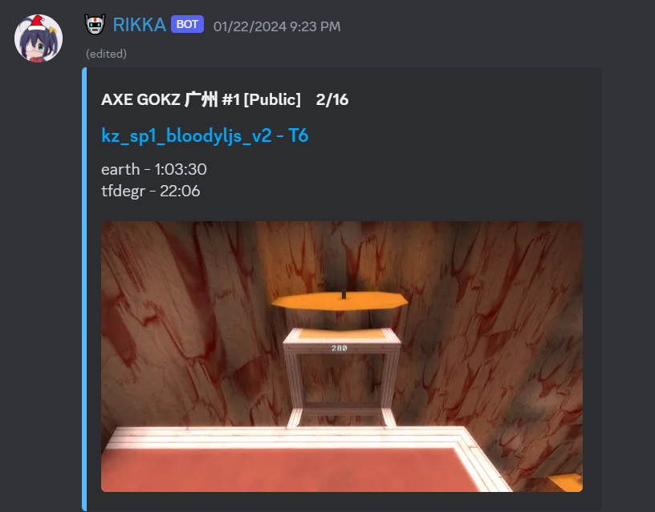
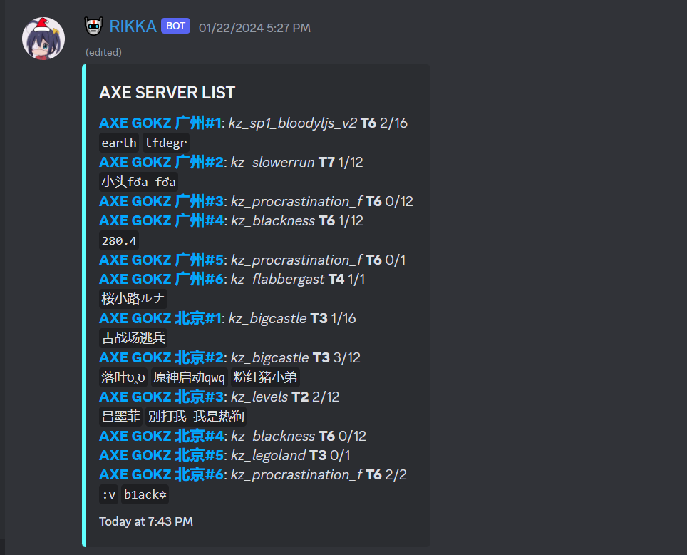

# Bot-Rikka

## CAUTION

⚠️ **Viewing this project will definitely waste your time!!!**

## Description

bot-rikka is a discord bot provide various features. Most of the codes from chatGPT

## Features

- query server info and send to your channel
- query local gokz database, get LJ top etc. 





## How to Use

1. Create an application in [discord](https://discord.com/developers/applications),  and get the Token

2. download the bot:

   `git clone https://github.com/cinyan10/bot-rikka.git `

   or download the zip

3. create a `.env` file in the bot folder, and set the config
   ``` 
   DISCORD_TOKEN=
   WEBHOOK_URL=
   WEBHOOK_URL_TEST=
   DB_HOST=
   DB_PORT=
   DB_PASSWORD=
   DB_USER=
   STEAM_API_KEY=
   TRENDING_WEBHOOK_URL=
   ```

4. set other configs in config.py

5. install requirements:

   ```shell
   pip install -r requirements.txt
   ```

   if there's an error

   > File "python3.12/site-packages/valve/source/messages.py", line 379, in <module>
   >  class Message(collections.Mapping):
   >                ^^^^^^^^^^^^^^^^^^^

    you can modify the `valve/source/messages.py` file in the `valve` library. Open the file and locate the line that starts with `class Message(collections.Mapping):`. Replace it with the following line:

   ```
   class Message(collections.abc.Mapping):
   ```

   This change ensures that the correct `Mapping` class is used

6. run the bot
   `python3 main.py`

7. waiting for it crash

